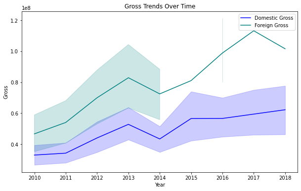

# Movie Business Analysis

## Author: Paul Waweru Mbugua

# Overview 
This project analyzes the movie business industry, and provides insights for Microsoft to make infomormed decision as they attempt to invest in this industry. 

***
# Business Problem
Microsoft, a widely renowned company has been following the movie and film industry, and has been hoping to invest in the industry. Therefore, Microsoft has decided to create a new movie studio. This project aims at exploring the main competitiors in the industry, the types of films produced in the industry, and their respective performances in the box office. 

Therefore, it is critical to explore how other studios' domestics and foreign grosses to gauge the gross amounts Microsoft will likely realize after opening its studios. Also, the highest grossing studios are likely to be Microsoft's main competitors. Besides, analyzing the genres with highest average ratings can provide a picture of the type of films Microsoft should produce, and the type of films to avoid.

Moreover, analyzing the film grosses over the years can enable Microsoft understand the market trends, and whether it would be worth investing in this industry. 
***
# Data Understanding
This project utilized data from [Box Office Mojo](https://www.boxofficemojo.com/) and [IMDB](https://www.imdb.com/) 

Box Office Mojo, powered by IMDbPro provides the box office receipts by period and area. 

IMDB contains a searchable database of movies, TV, entertainment programs, and their cast and crew members. They provide box office data, for example, the average rating, run time minutes, language, writers, and other information.  
***
# Objectives 
* To identify the largest studios by movie production? 
* To identify the top 10 highest grossing studios during the time period?
* To identify the domestic and foreign grossing trend over the years 
* To identify the lowest and highest rated genres for the time period?
***
# Data Analysis
The data analysis includes data preparation process and exploratory data analysis.

The data preparation involves:
* Checking the null values and dropping them
* Checking duplicate values
* Checking for inconsistencies in the data
* Checking for anomalies
***
## Largest Studios by Movie Production

***
## Highest Grossing Studios in the Domestic Market

***
## Highest Grossing Studios in the Foreign Market

***
## Grossing Trend in the Time Period

***
## Highest Rated Genres

***
## Lowest Rated Genres

***
# Conclusion
BV, Universal, Warner Bros, Fox, Sony, and Paramaount are the top five highest grossing studios in the domestic market, respectively. Also, BV, Fox, Warner Bros, Universal, Sony, and Paramaount are the highest grossing studios in the foreign market, respectively. These studios will likely pose the fiercest competition to Miscrosoft.  

The domestic trend rose steadily from 2010 to 2013, fell sharply in 2014, but rose steadily again upto 2017. However, it fell sharply again in 2018. The overall trend is bullish, and the industry is likely to perform well in future. We need more data points to have a clearler picture of the tend.

Addittionally, the top rated genres include: Comedy, Documentary, Fantasy; Documentary, Family, Musical; Game-Show; Documentary, Movies, Sport; and, Documentary, News, Reality-TV, respectively. Also, the lowest rated genres include: Comedy, Music, Sport; Adult, Horror; History, Sci-Fi, Thriller; Adventure, Crime, Romance; and, Crime, Music, respectively. One would expect that the highest rated genres are the most liked, hence the most likely to sell, and vice versa. However, we have not tested this hypothesis. 
*** 
# Reccommendations 
From the above analysis, the overall industry performance is expected to be positive. Therefore, Microsoft can expect that its profitability will not be impacted by volatility caused to the industry by the economy. However, Microsoft can expect stiff competition within the industry, especially from the highest grossing studios.

However, there are some weaknesses in the data. For example, the data runs from 2010 to 2018. Thus, the data does not encompass the most significant economic events of the 21st century, that is, the 2009 global housing crisis, and the COVID-19 pandemic. Data collected from these events will improve our analysis.

Addittionally, the data might not provide some key insights. For example, we could not explore the relationship between genre ratings and grossing. The relationship can enable Microsoft identify whether there is a relationship between ratings and grossing among the genres. 

In future, I hope plot time series plots like MA, AR, ARMA, and conduct some statistical tests to improve the analysis.